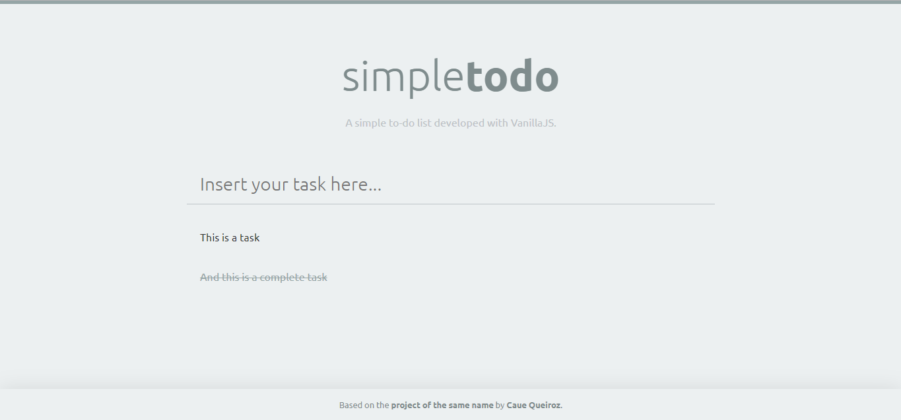

# Simple Todo

A simple to-do list made with VanillaJS. Based on the [project with the same name](https://github.com/cauequeiroz/simpletodo) by [Caue Queiroz](http://cauequeiroz.com.br/about/).

You can see it in action [here](https://guilhermemj.github.io/simple-todo) (lacks IE support).

## Features

* Add/Remove tasks;
* Mark items as completed;
* Integrated with localStorage so you won't lose your list by reloading the window or closing the browser.

## Involved studies

* localStorage API;
* ES6 Classes and best practices;
* Data Interfaces;
* Working with Events in VanillaJS;
* DOM manipulation with VanillaJS;
* Data validation with proper Error throwing.

As a bonus, I trained some concepts of RESTful APIs, separation of concerns and architectural patterns (in a very tiny scale).

